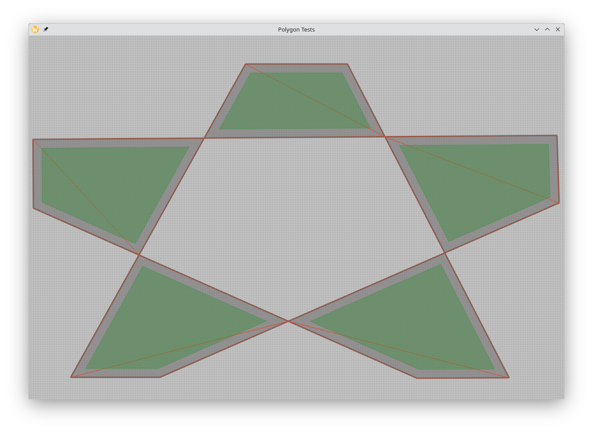
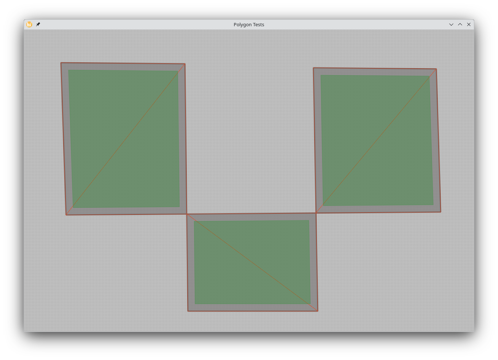

# Project for testing polygon algorithms

## How To

1. Draw a polygon by clicking on the points
2. Finish drawing by pressing Enter
3. View the result

## Results

- Red lines are triangulation
- Gray areas are polygons
- Green areas are offset internal polygons

## Algorithms

- [earcut.hpp](https://github.com/mapbox/earcut.hpp) is used for triangulation.
- [Clipper2](https://github.com/AngusJohnson/Clipper2) is used to remove self-intersections and offsets.
- [Qt](https://www.qt.io/) is used to display all of this.

## Screenshots

