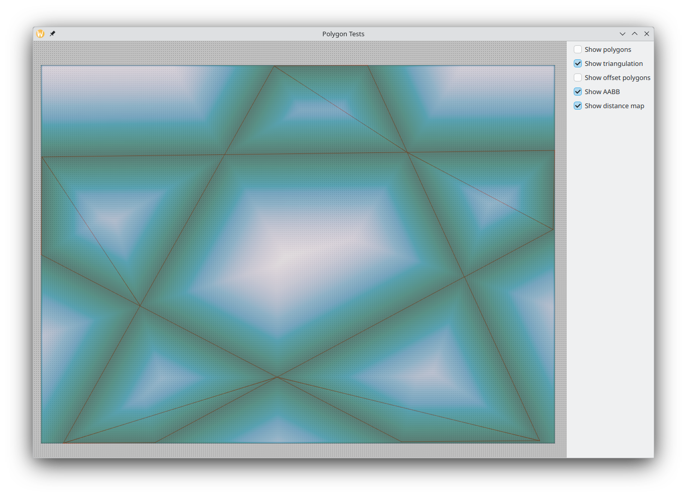
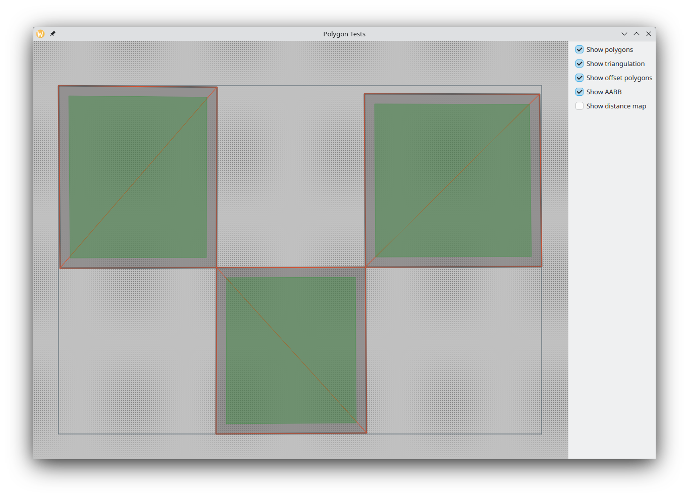

# Project for testing polygon algorithms

## How To

1. Draw a polygon by clicking on the points.
2. Finish drawing by pressing Enter.
3. View the result.

## Results

- Red lines are triangulation.
- Gray areas are polygons.
- Green areas are offset internal polygons.
- Heatmap is a signed distance field (SDF) to a triangle mesh.

## Libraries

- [earcut.hpp](https://github.com/mapbox/earcut.hpp) is used for triangulation.
- [Clipper2](https://github.com/AngusJohnson/Clipper2) is used to remove self-intersections and offsets.
- [Discregrid](https://github.com/InteractiveComputerGraphics/Discregrid) is used to compute SDF.
- [Eigen](https://eigen.tuxfamily.org) is a powerful linear algebra library.
- [Qt](https://www.qt.io/) is used to display all of this.

## Screenshots

